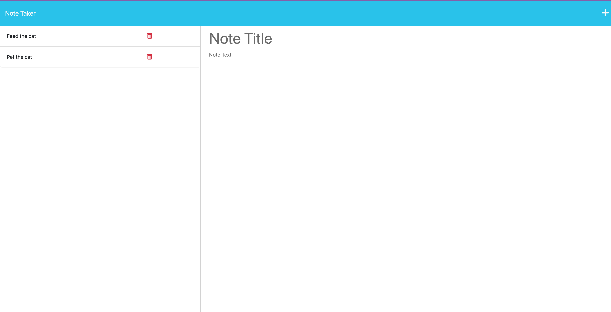

# [WRITE-THAT-DOWN](#table-of-content)

## [Description](#table-of-content)
It's a note taker. You can write and save notes. <mark>It cannot be deleted.</mark> Be careful of what you write!

## Table of Content
* [Description](#description)
* [Installation](#installation)
* [Usage](#usage)
* [Credits](#credits)

## [Installation](#table-of-content)
This application is build from starter code, [Note Taker](https://github.com/coding-boot-camp/miniature-eureka). 

The application will be deployed to Heroku.
[Press here to go see the deployed application](https://write-that-down.herokuapp.com/)

## [Usage](#table-of-content)
Use this [link](https://write-that-down.herokuapp.com/) to open the application. Press "Get Started" and it will led you to another page similar to this screenshot below. 

You may click Note Title or Note Text to write down a note.
Click (💾) button to save when you have filld both title and text.
Please be careful of what you write. <mark>It cannot be delete.</mark>

## [Credits](#table-of-content)
Packages for this project
* Express.js
* Heroku

Without these guidences, my application would not exist.
* [How To Deploy to Heroku in 5 Minutes](https://www.youtube.com/watch?v=DQk3zJlY-eE)
* [Heroku Status](https://devcenter.heroku.com/articles/heroku-status#:~:text=Accessing%20Heroku%20Status,-The%20current%20status&text=The%20heroku%20CLI%20can%20be,known%20issues%20at%20this%20time.)
* [Express.js quick guide](https://www.tutorialspoint.com/expressjs/expressjs_quick_guide.htm)
* [Heroku: Heroku cannot detect the buildpack to use for this application automatically.](https://help.heroku.com/1MC2J0GF/why-does-my-app-fail-to-detect-a-buildpack)
* 21-Ins_Modular_Routing
* 25-Ins_Heroku
* 26-Stu_Heroku
